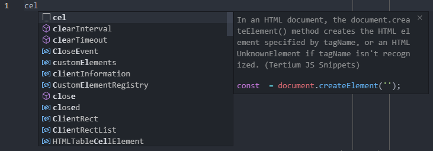
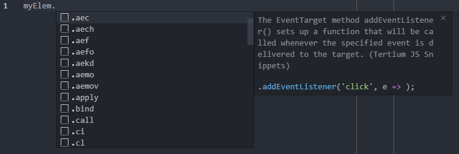

# JavaScript Snippets for Visual Studio Code

Collection of JavaScript snippets for your productivity.

## Features

### Classic declarations



### Dot declarations



## Declarations

```text
.ac -> .appendChild($1)
.ae -> .addEventListener('$1', )
.aeblu -> .addEventListener('blur', $1)
.aecha -> .addEventListener('change', $1)
.aecli -> .addEventListener('click', $1)
.aefoc -> .addEventListener('focus', $1)
.aefoco -> .addEventListener('focusout', $1)
.aeinp -> .addEventListener('input', $1)
.aekey -> .addEventListener('keydown', $1)
.aemou -> .addEventListener('mouseover', $1)
.aemouo -> .addEventListener('mouseout', $1)
.app -> .apply($1)
.bin -> .bind($1)
.cal -> .call($1)
.cat -> .catch((error) => { $1 })
.catm -> .catch(error => console.log(error))
.cl -> .classList
.cladd -> .classList.add('$1')
.clcon -> .classList.contains('$1')
.clrem -> .classList.remove('$1')
.clrep -> .classList.replace('$1', '')
.clri -> .clearInterval($1)
.clrt -> .clearTimeout($1)
.cltog -> .classList.toggle('$1')
.cn -> .cloneNode($1)
.con -> .concat($1)
.con -> .contains($1)
.copw -> .copyWithin($1)
.de -> .dispatchEvent($1)
.ent -> .entries($1)
.eve -> .every(($1) => { return $1; })
.evem -> .every($1 => $1)
.fil -> .fill($1)
.filt -> .filter(($1) => { return $1; })
.filtm -> .filter($1 => $1)
.fin -> .find(($1) => { return $1; })
.fini -> .findIndex(($1) => { return $1; })
.finim -> .findIndex($1 => $1)
.finm -> .find($1 => $1)
.fore -> .forEach(($1) => { $1 })
.forem -> .forEach($1 => $1)
.ga -> .getAttribute('$1')
.gebc -> .getElementsByClassName('$1')
.gebi -> .getElementById('$1')
.gebt -> .getElementsByTagName('$1')
.ha -> .hasAttribute('$1')
.ib -> .insertBefore($1)
.ih -> .innerHTML
.inc -> .includes($1)
.indo -> .indexOf($1)
.joi -> .join($1)
.key -> .keys($1)
.lio -> .lastIndexOf($1)
.map -> .map(($1) => { return $1; })
.mapm -> .map($1 => $1)
.oh -> .outerHTML
.pe -> .parentElement
.pn -> .parentNode
.pop -> .pop()
.pro -> .prototype
.pus -> .push($1)
.qs -> .querySelector('$1')
.qsa -> .querySelectorAll('$1')
.ra -> .removeAttribute('$1')
.red -> .reduce((accumulator, currentValue) => { return accumulator + currentValue; })
.redm -> .reduce((accumulator, currentValue) => accumulator + currentValue)
.redr -> .reduceRight((accumulator, currentValue) => { return accumulator.concat(currentValue); })
.redrm -> .reduceRight((accumulator, currentValue) => accumulator.concat(currentValue))
.remc -> .removeChild($1)
.reme -> .removeEventListener('$1', )
.repc -> .replaceChild($1, )
.rev -> .reverse()
.sa -> .setAttribute('$1', '')
.seti -> .setInterval(() => { $1 }, 3000)
.setim -> .setInterval(() => {$1}, 3000)
.sett -> .setTimeout(() => { $1 }, 3000)
.settm -> .setTimeout(() => {$1}, 3000)
.shi -> .shift()
.sli -> .slice()
.som -> .some((item) => { return $1; })
.somm -> .some($1 => $1)
.sor -> .sort((a, b) => { if ($1) { return -1; } if () { return 1; } return 0; })
.sorm -> .sort((a, b) => a - b)
.spl -> .splice($1)
.tc -> .textContent
.tf -> .toFixed($1)
.thec -> .then(($1) => { $1 }) .catch(error => console.log(error))
.them -> .then($1 => $1)
.tls -> .toLocaleString($1)
.ts -> .toString($1)
.uns -> .unshift($1)
.val -> .values($1)
arrfr -> Array.from($1)
arris -> Array.isArray($1)
arrof -> Array.of($1)
cd -> console.dir($1)
ce -> console.error($1)
ci -> console.info($1)
cl -> console.log($1)
cls -> class $1 { constructor(props) {} }
cre -> const $1 = document.createElement('$1');
cw -> console.warn($1)
deb -> debugger;
doc -> document
dowhi -> do { $1 } while ();
ecls -> export class $1 { constructor(props) {} }
edcls -> export default class $1 { constructor(props) {} }
fn -> function $1() { }
fna -> function() { $1 }
fnar -> ($1) => { return $1; }
fnaraf -> ($1, i, arr) => { return $1; }
fnarm -> $1 => $1
for -> const len = $1.length; for (let i = 0; i < len; i += 1) { const item = $1[i]; }
foraof -> for await (let item of $1) { }
forin -> for (const key in $1) { }
form -> for (let y = 0; i < $1Len; y += 1) { const item = $1[y]; }
forof -> for (const item of $1) { }
forr -> for (let r = $1Len - 1; r >= 0; r -= 1) { const rItem = $1[r]; }
iife -> (function() { $1 })();
imp -> import { } from '$1';
impm -> import from '$1';
jsonp -> JSON.parse($1)
jsons -> JSON.stringify($1)
newm -> new Map($1)
newp -> new Promise((resolve, reject) => { resolve($1) })
news -> new Set($1)
obje -> Object.entries($1)
objk -> Object.keys($1)
objv -> Object.values($1)
pa -> Promise.all($1)
pf -> parseFloat($1)
pi -> parseInt($1)
swi -> switch ($1) { case '': break; default: }
us -> 'use strict';
wale -> alert('$1')
wcon -> confirm('$1')
whi -> while ($1) { }
wpro -> prompt('$1')
```
